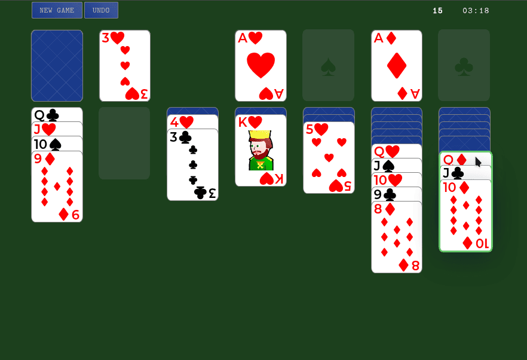

#+title: ♠️ Solitaire
#+date: Mon Jul 13 09:34:21 AM -04 2026
#+author: Richard Frangie
#+language: en

#+html: 
#+html: 
#+html: 
#+html: 
#+html:   

A minimalistic, responsive web-based Solitaire game built with vanilla JavaScript, focusing on game logic and click-based interactions.

* Demo
[[https://richardfrangie.github.io/solitaire/][Live demo →]]

* Overview
This is a from-scratch implementation of Solitaire, built with vanilla JavaScript, Vite,
and a single Web Component ~playing-card~. There is no framework, and no dependencies: game logic is plain DOM manipulation in one file.

This project is the third step in a continuous learning sequence. It stands on top of two earlier projects:

1. [[https://github.com/richardfrangie/52-card-deck][Standard 52-Card Deck]] - every card of a standard deck rendered with HTML and CSS only. This is where card faces, suits, ranks, and face cards were first solved visually, with no JavaScript.
2. [[https://github.com/richardfrangie/playing-card][Playing card]] - encapsulating cards into a Web Component

The primary focus of this project was on implementing robust game logic through JavaScript functions, using a click-based interaction model instead of the more conventional drag-and-drop approach.

* Features
- *Click-based interaction*: Select a card or card sequence, then click a destination to move
- *Undo history*: Step back through your moves
- *Timer & move counter*: Live updates to track your progress
- *Victory detection*: Automatic win detection with a celebratory popup modal
- *Responsive design*: Works on various screen sizes
- *Minimalist design*: Clean and focused UI

* Technologies
- HTML5 :: Semantic markup with custom ~<playing-card>~ web component
- CSS3 :: Custom properties, responsive design with CSS variables, and flexbox
- JavaScript (Vanilla) :: Game logic, state management, DOM manipulation, and event handling
- Web Components :: Encapsulated ~<playing-card>~ element with shadow DOM and attribute-based configuration

* Future Improvements
- Refactor into a modular architecture with clear separation of concerns (State, Logic, Renderer, EventHandler)
- Add unit and integration tests (currently untested; modular refactor needed first to enable effective testing)
- Drag-and-drop card movement
- Card animations and transitions
- A "hint" feature: highlight a legal move
- Double-click auto-move
- Add save and load to localStorage

* Known Limitations
- Monolithic architecture: The code currently resides in a single controller module, mixing game logic, rendering, and event handling.
- Only click-based interaction (no drag-and-drop)
- No animations yet

* Controls
Click a card to select it
Click a valid destination to move

* References
- [[https://github.com/richardfrangie/52-card-deck][Standard 52-Card Deck]]
- [[https://github.com/richardfrangie/playing-card][Playing card]]
